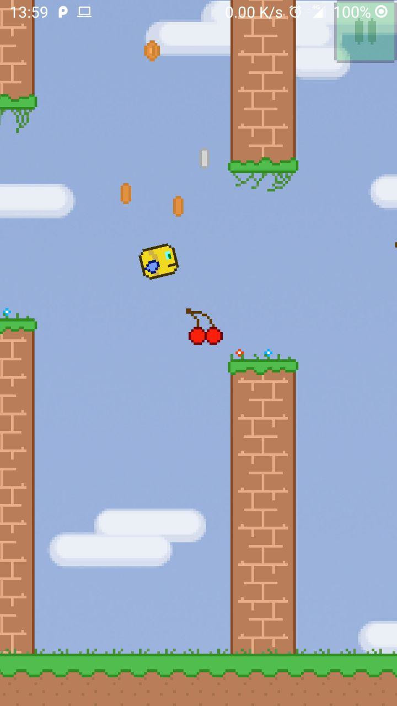

# Pixy Bird - Hack3dEngine [WIP]

Made using my owne Hack3dEngine, the engine aims to provide multiple support for different platforms in C++. The engine uses the Android NDK and will provide support for Windows, Linux and other platforms, to run the same in different platforms.

To make the bird fly touch the left or right part of the screen.

[Download Android Google Play](https://play.google.com/store/apps/details?id=com.hack2s.pixy_bird)

